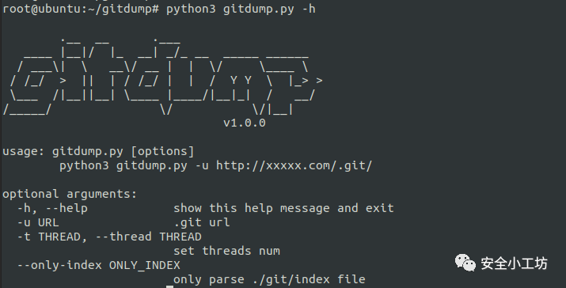
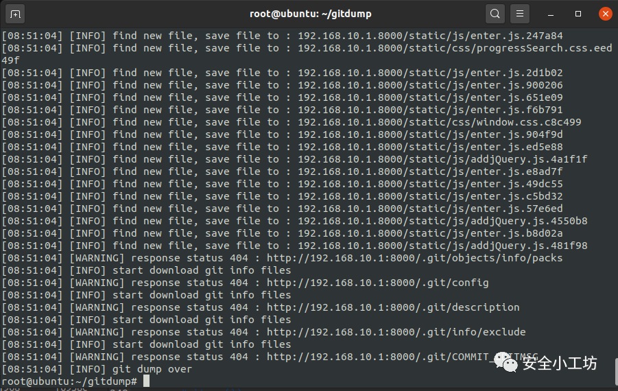

## **简介**

之前扫出来一些.git泄露漏洞，在用git泄露工具下载恢复的时候，要不漏报，要不慢的要死，还有的扫一半工具直接挂了的。。。然后就开始研究起这些工具的原理来了。这里简单说一下比较流行的工具`GitHack`和`Git_Extract`

- GitHack：支持python2和python3，支持多线程，但只通过`.git/index`来提取文件hash，可能存在漏报。
- Git_Extract：比GitHack有更多的发现方式，但只支持python2，还只能是单线程，遇到文件比较多或者网不好的网站，扫半天都结束不了。

## **gitdump**

根据GitHack和Git_Extract拼凑改良的一个小工具,index解析取自GitHack，pack解析取自Git_Extract并修改为python3格式，整体框架重新编写。

- 支持python3
- 支持多线程
- 支持多种提取方式，能够恢复其他分支和历史版本
- 增加进度提示

具体介绍可见https://mp.weixin.qq.com/s/XB0i-4jSJkgmLLIJRMIs6A

## 其他

- [xnmap:一个比nmap更专注于服务识别的工具](http://mp.weixin.qq.com/s?__biz=MzU5MTE4Mzk0NQ==&mid=2247484131&idx=1&sn=7dc1b9de9cba9975e2731615c2c542d5&chksm=fe33abc5c94422d32c157361f3fc559fb207a0dc3e1c792072c5db68ba7ccfa7aaff67574624&scene=21#wechat_redirect)
- [git文件泄露利用原理及工具](http://mp.weixin.qq.com/s?__biz=MzU5MTE4Mzk0NQ==&mid=2247484141&idx=1&sn=aa37e2aa72dbb85bdd3c69dc4d5ae505&chksm=fe33abcbc94422dd393ba30ce8e51fce89a69377141b563927b7b4890278bfb91ba31983110e&scene=21#wechat_redirect)
- [快速搭建个人使用的dnslog平台](http://mp.weixin.qq.com/s?__biz=MzU5MTE4Mzk0NQ==&mid=2247484040&idx=1&sn=973edb1f93b24f1d4d0e77f120fb8561&chksm=fe33abaec94422b8c6ce5112d783c3314764ee1bd757313f02a0b3701c33d7d747d9b2d32a3f&scene=21#wechat_redirect)
- [对dirsearch的一些小改造](http://mp.weixin.qq.com/s?__biz=MzU5MTE4Mzk0NQ==&mid=2247484011&idx=1&sn=468cc94d5a30f5d0193eff1f67fd2f9e&chksm=fe33ab4dc944225b3ec50e579676a1634cc5d617481386e28fd16c9779866ab8ea5aabfdad1d&scene=21#wechat_redirect)
- [Oneforall工具分析与改造](http://mp.weixin.qq.com/s?__biz=MzU5MTE4Mzk0NQ==&mid=2247483998&idx=1&sn=1e77829d7c54bffea9cedf31cba0d6ae&chksm=fe33ab78c944226e609cfbb827ca961304e325df04cce987bcd4416e7db426a5d9c43a1247ab&scene=21#wechat_redirect)
- [Xpocsutie3：基于pocsuite3二次修改的POC检测框架](http://mp.weixin.qq.com/s?__biz=MzU5MTE4Mzk0NQ==&mid=2247483948&idx=1&sn=a039e928c11f9f7102994843817aa3ec&chksm=fe33ab0ac944221c4e40900975c58a89dbe1af42d9ec53c076dda905428f52714dd0342f771d&scene=21#wechat_redirect)
